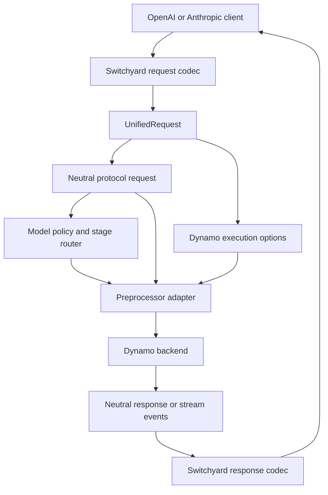

# Switchyard Translation Integration

This design note evaluates using
[`switchyard-protocol`](https://github.com/NVIDIA-NeMo/Switchyard/tree/main/crates/protocol)
and
[`switchyard-translation`](https://github.com/NVIDIA-NeMo/Switchyard/tree/main/crates/switchyard-translation)
inside the Dynamo frontend. The goal is to improve protocol translation and model routing without
introducing a separate Switchyard proxy or losing Dynamo-specific inference controls.

The analysis is based on Switchyard commit
[`bb011ca`](https://github.com/NVIDIA-NeMo/Switchyard/commit/bb011ca452c2274ea10c4a4cc55264e54abf0a62)
from September 1, 2026.

## Recommendation

Adopt Switchyard's neutral protocol and translation layers inside Dynamo, but do not replace
Dynamo's `UnifiedRequest` with `switchyard_protocol::LlmRequest` directly.

Instead, evolve `UnifiedRequest` into a composite envelope containing:

1. Switchyard's normalized request, preservation data, and correlation metadata.
2. Dynamo-specific execution and preprocessing options.

This approach can preserve existing Dynamo behavior while adding provider-neutral routing,
request/response/stream translation, explicit loss diagnostics, and richer coding-agent metadata.

> [!IMPORTANT]
> Cross-provider translation cannot guarantee that every feature is understood by every target
> API. A safe definition of lossless is: preserve information when possible and reject or report
> every conversion that cannot preserve its meaning.

## Current Dynamo representation

Dynamo's current `UnifiedRequest` contains a fully converted OpenAI Chat Completions request plus
an API-specific context enum:

```rust
pub struct UnifiedRequest {
    pub inner: NvCreateChatCompletionRequest,
    pub api_context: ApiContext,
}
```

Anthropic Messages and OpenAI Responses requests are converted into
`NvCreateChatCompletionRequest`. Selected fields that do not fit Chat Completions are retained in
`AnthropicContext` or `ResponsesContext`.

This provides an incremental compatibility layer, but it has several limitations:

- OpenAI Chat remains the canonical internal protocol rather than a provider-neutral format.
- Each newly preserved provider field requires another typed sidecar field.
- Unknown provider fields do not have a general preservation contract.
- There is no common neutral representation for buffered responses or streaming events.
- The HTTP handlers currently extract the sidecar and unwrap the request before preprocessing.
- Model stage routing consumes OpenAI `ChatCompletionRequestMessage` directly, so semantic routing
  is available only for Chat Completions traffic.

## Switchyard representation

Switchyard decodes each supported wire protocol into an `LlmRequest`. The normalized request
contains:

- Separate system and developer instructions
- Text, reasoning, refusal, image, audio, video, file, and unknown content blocks
- Structured tool calls and tool results, including explicit error state
- Common sampling, output, reasoning, and tool-choice fields
- Provider extensions for fields without a neutral equivalent
- Exact source payloads for same-format preservation

Switchyard also defines neutral buffered responses and stream events. The translation engine has
codecs for:

- OpenAI Chat Completions
- OpenAI Responses
- Anthropic Messages

The engine can decode or encode requests and responses, translate between two formats, and
translate streaming events incrementally.

## Proposed Dynamo envelope

```rust
pub struct UnifiedRequest {
    /// Neutral request, original-wire preservation, and request metadata.
    pub protocol: switchyard_protocol::Request,

    /// Dynamo-specific inference and preprocessing controls.
    pub dynamo: DynamoRequestOptions,
}

pub struct DynamoRequestOptions {
    pub nvext: Option<NvExt>,
    pub common: CommonExt,
    pub chat_template_args: Option<HashMap<String, serde_json::Value>>,
    pub media_io_kwargs: Option<MediaDecoder>,
    pub mm_processor_kwargs: Option<serde_json::Value>,
    pub return_tokens_as_token_ids: Option<bool>,
}
```

Switchyard owns wire-protocol meaning. Dynamo continues to own execution behavior.



This remains one Dynamo frontend process. It does not create a Switchyard-to-Dynamo service
pipeline.

## Compatibility analysis

### Capabilities that map directly or improve

| Concern | Current Dynamo | With Switchyard protocol and translation |
|---|---|---|
| Text messages | OpenAI Chat representation | Provider-neutral blocks |
| System instructions | Converted to Chat system messages | Separate ordered instruction blocks |
| Developer instructions | Dependent on Chat representation | First-class role |
| Tool calls | OpenAI-shaped arguments | Structured JSON arguments |
| Tool results | Chat tool messages | First-class blocks with optional error state |
| Reasoning | Parser and API-specific handling | Text, signatures, and structured detail blocks |
| Multimodal input | Chat-compatible media types | Images, audio, video, files, and raw sources |
| Unknown content | Often rejected, skipped, or manually retained | `Unknown` blocks plus raw provider extensions |
| Buffered responses | API-specific converters | Neutral aggregate response |
| Streaming | API-specific converters | Neutral incremental events and stream state |
| Usage | Endpoint-specific mapping | Normalized input, cache, output, reasoning, and total tokens |
| Conversion loss | Often implicit or endpoint-specific | Allow with diagnostics or reject |
| Target compatibility | Validated during individual conversions | Declared target capability policy |
| Session metadata | Primarily request headers and local context | Normalized session, agent, task, turn, and lineage metadata |

### Dynamo fields that must remain

Switchyard's neutral IR does not first-class all Dynamo execution features. These must stay in
`DynamoRequestOptions` or gain explicit neutral fields before the current representation is
removed:

- `nvext`, including annotations and routing overrides
- `ignore_eos`, `min_tokens`, and stop-token IDs
- `min_p`, repetition penalty, and Dynamo guided-decoding controls
- `chat_template_args`
- `media_io_kwargs` and `mm_processor_kwargs`
- `return_tokens_as_token_ids`
- Backend-specific preprocessing and output controls

Several standard OpenAI fields, including penalties, seed, `n`, log probabilities, service tier,
and stream options, may be retained in Switchyard provider extensions or exact preservation data.
They are not necessarily meaningful when encoded for another provider.

## Meaning of lossless migration

### Same-format preservation

Switchyard can retain an exact parsed source request or response and replay it when encoding to the
same format. This is useful for fields that Dynamo does not interpret.

The recommended Dynamo default is in-memory preservation. Embedded preservation stores original
payloads inside provider metadata and should be opt-in because it can:

- Increase payload and memory size
- Expose sensitive request data to another provider
- Exceed provider metadata limits
- Be rejected by strict upstream APIs

### Cross-format conversion

OpenAI Chat, OpenAI Responses, and Anthropic Messages do not have identical feature sets. For
example, reasoning blocks, media types, structured-output constraints, tool semantics, and cache
controls may not have an exact target representation.

Dynamo should use `LossyConversionPolicy::Reject` during initial adoption. Operators may later
enable `AllowWithDiagnostics` for explicitly accepted degradations.

Preservation allows later reconstruction of original data, but it does not make an unsupported
feature visible to the selected model.

### Mutation and preservation

Model routing changes the request's model field, while preprocessing may add prompts or transform
messages. Exact preserved payloads must be invalidated or restamped after such mutations. Encoding
an unchanged preserved body after changing the normalized request would silently discard the
mutation.

Switchyard provides target-preparation helpers for model and prompt changes, but Dynamo adapters
must make this ownership rule explicit.

## Model-router gains

The existing Dynamo stage router examines OpenAI Chat message types. Running model policy against
the neutral request would provide:

- Semantic stage routing for Anthropic Messages and OpenAI Responses
- One implementation of tool classification and error extraction
- Explicit tool-result failure signals
- Normalized reasoning and compaction signals
- Session affinity using correlation metadata
- Subagent-aware policies using agent lineage and task metadata
- A clean input contract for future classifier and escalation policies

This is the lowest-risk first use of the Switchyard IR because the selected request can still flow
through Dynamo's existing preprocessing and backend path.

## Response and streaming gains

Replacing the existing endpoint-specific response converters would eventually provide:

- One normalized stop-reason mapping
- Common usage accounting, including cache and reasoning tokens
- Structured tool-call delta assembly
- Provider-neutral mid-stream error handling
- Same-format stream-event replay
- Cross-format streaming without buffering an entire response
- Codex tool-namespace preservation across Responses and Chat formats

Response migration is higher risk than request shadowing because clients depend on precise event
ordering, required nullable fields, identifiers, error shapes, and terminal events.

## Migration plan

### Phase 1: Characterization tests

Create golden request, response, and stream fixtures for all three protocols. Include:

- Text and multimodal messages
- System and developer instructions
- Tools, parallel tool calls, and tool errors
- Reasoning and encrypted or signed reasoning details
- Structured output
- Cache controls and cache usage
- Unknown provider fields and content blocks
- Every `nvext` and `CommonExt` option
- Disconnects, malformed events, and mid-stream errors

Record current accepted, rejected, and emitted behavior before changing runtime paths.

### Phase 2: Shadow decoding

Decode requests through both the existing Dynamo types and Switchyard. Compare normalized content
and emit metrics for disagreements, but keep current serving behavior unchanged.

Suggested metrics include:

- Translation decode errors by source format
- Loss diagnostics by field and source/target format
- Shadow representation mismatches
- Added request bytes from preservation
- Translation duration

Do not log raw prompts, tool arguments, or preserved payloads.

### Phase 3: Neutral model-policy input

Change model policies and stage routing to consume the neutral request. Retain the existing Dynamo
request for preprocessing and backend execution.

This phase delivers cross-protocol semantic routing without changing inference behavior.

### Phase 4: Composite preprocessing adapter

Implement Dynamo preprocessing traits over the composite `UnifiedRequest`. Map neutral content into
the existing prompt and media pipeline while reading execution controls from
`DynamoRequestOptions`.

Avoid a JSON encode/decode bridge between `LlmRequest` and `NvCreateChatCompletionRequest`; use
typed Rust adapters to retain validation and reduce allocations.

### Phase 5: Buffered response translation

Move one endpoint at a time to the neutral aggregate response. Keep a feature flag and compare new
serialized output against the current response converter.

### Phase 6: Streaming translation

Adopt neutral stream events after buffered parity. Validate event ordering, IDs, tool argument
fragments, usage, errors, disconnect cancellation, and terminal markers.

### Phase 7: Remove compatibility types

Remove `ApiContext` and bespoke converters only after differential tests demonstrate parity and all
Dynamo execution controls have an explicit owner.

## Dependency and release considerations

At the reviewed revision:

- Switchyard packages are version `0.2.0` and are still evolving before `1.0`.
- Switchyard requires Rust `1.96.1`.
- Dynamo currently pins Rust `1.93.1`.

A direct dependency therefore requires either upgrading Dynamo's toolchain or lowering and testing
Switchyard's minimum supported Rust version. Pin an exact release or commit during the migration;
do not track Switchyard `main` in production builds.

The recommended ownership model is to consume the upstream Switchyard crates or establish a shared
NVIDIA protocol crate. Copying the codecs into Dynamo would create two implementations and ongoing
behavior drift.

## Operational requirements

Before production rollout, establish:

- Expected request rate and concurrent streams
- Request and preserved-payload size limits
- Translation latency and memory budgets
- Availability and error-rate objectives
- Multi-tenant isolation requirements
- Upgrade and rollback strategy for codec changes

Translation metrics and diagnostics must use bounded labels. Preserved payloads should remain
request-scoped, should never be logged, and must be released promptly after completion or client
disconnect.

## Alternatives

### Keep the current Dynamo sidecars

This has the smallest immediate dependency risk, but every new provider feature needs additional
conversion and response reconstruction code. Routing also remains coupled to Chat Completions.

### Copy Switchyard translation code into Dynamo

This avoids an external crate dependency and toolchain coordination, but creates duplicate NVIDIA
implementations and makes fixes difficult to share. This is not recommended.

### Run Switchyard as a separate proxy

This provides translation without changing Dynamo internals, but adds another network hop,
deployment, failure boundary, and configuration surface. It also conflicts with the goal of one
Dynamo frontend router. This is not recommended for the integrated design.

## Decision summary

Proceed with a composite `UnifiedRequest` and a phased migration:

1. Preserve all Dynamo execution controls.
2. Add Switchyard's neutral protocol request in shadow mode.
3. Move model selection and stage routing to the neutral request first.
4. Adopt response and stream translation only after differential parity testing.
5. Treat cross-format loss as an explicit error until operators choose otherwise.

This path avoids a routing pipeline, limits blast radius, and provides meaningful protocol and
routing gains without requiring a flag-day replacement of Dynamo's frontend.

## References

- [Dynamo frontend model router](model-router.md)
- [Dynamo frontend overview](README.md)
- [Switchyard architecture](https://github.com/NVIDIA-NeMo/Switchyard/blob/main/docs/architecture.md)
- [Switchyard protocol types](https://github.com/NVIDIA-NeMo/Switchyard/blob/main/crates/protocol/src/llm.rs)
- [Switchyard translation engine](https://github.com/NVIDIA-NeMo/Switchyard/blob/main/crates/switchyard-translation/src/engine.rs)
- [Switchyard translation policies](https://github.com/NVIDIA-NeMo/Switchyard/blob/main/crates/switchyard-translation/src/policy.rs)
- [Switchyard lossless round-trip tests](https://github.com/NVIDIA-NeMo/Switchyard/blob/main/crates/switchyard-translation/tests/lossless_roundtrip.rs)
